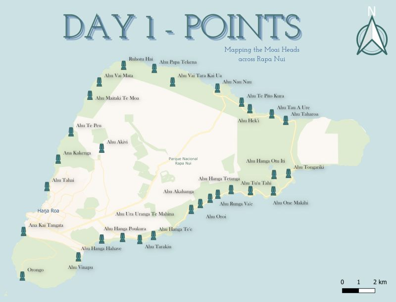

## 30 Day Map Challenge: by Zaana!

This is a quick website for all the maps I've made for 2021's [30 Day Map Challenge](https://github.com/tjukanovt/30DayMapChallenge). This is my first year participating and I've had a blast!

Even though it was not a requirement, I managed to complete a map for each day. My main motivations for this challenge were to revisit old techniques, learn new ones, and try to create whatever I can, even if it were a map done in 5 minutes' time!

This was an amazing opportunity to build my confidence in mapping, as well as network with some amazing people in the field! I am a fan of every single person who made something this month, and I can't wait to see what everyone gets up to in the future.

I also posted my maps daily on both [Twitter](http://twitter.com/zaaaana_) and [LinkedIn](http://linkedin.com/in/zaaaana), so feel free to connect with me on either platform!

Now, let's get into it!


### Day 1: Points
_Created in QGIS. Map of Rapa Nui (Easter Island) highlighting locations of Moai statues_


### Day 2: Lines
_Created in QGIS. Map highlighting travel flow from the UK to the rest of the world_


### Day 3: Polygons
_Created in QGIS. Simple polygon map showcasing the glacial cover of Jan Mayen, Svalbard_
https://github.com/zaaaana/30DMC21/blob/main/Maps/day3_polygons.jpg

Markdown is a lightweight and easy-to-use syntax for styling your writing. It includes conventions for

```markdown
Syntax highlighted code block

# Header 1
## Header 2
### Header 3

- Bulleted
- List

1. Numbered
2. List

**Bold** and _Italic_ and `Code` text

[Link](url) and 
```

For more details see [Basic writing and formatting syntax](https://docs.github.com/en/github/writing-on-github/getting-started-with-writing-and-formatting-on-github/basic-writing-and-formatting-syntax).

### Jekyll Themes

Your Pages site will use the layout and styles from the Jekyll theme you have selected in your [repository settings](https://github.com/zaaaana/30DMC21/settings/pages). The name of this theme is saved in the Jekyll `_config.yml` configuration file.

### Support or Contact

Having trouble with Pages? Check out our [documentation](https://docs.github.com/categories/github-pages-basics/) or [contact support](https://support.github.com/contact) and we’ll help you sort it out.
