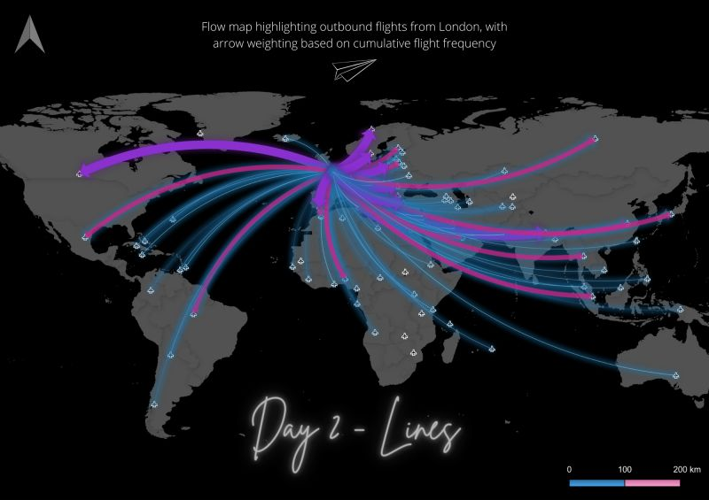
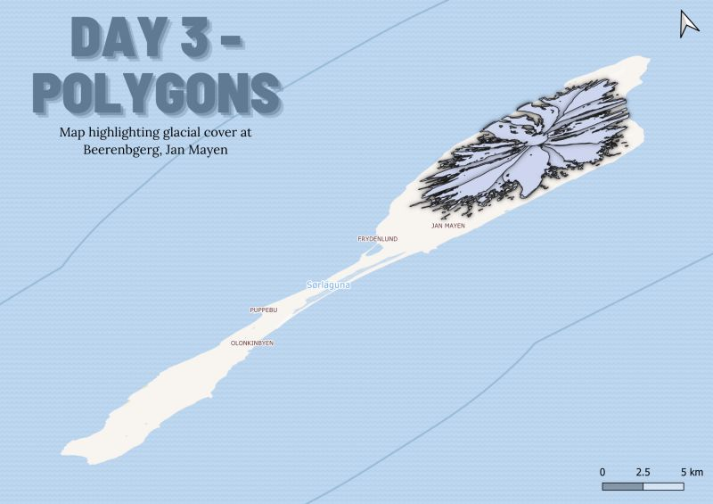
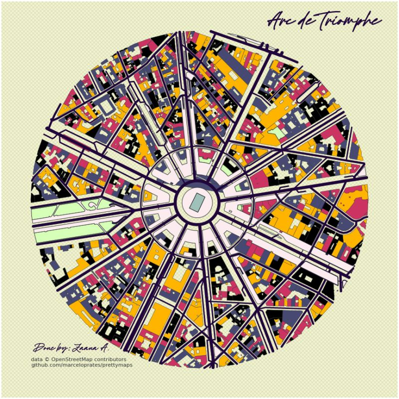
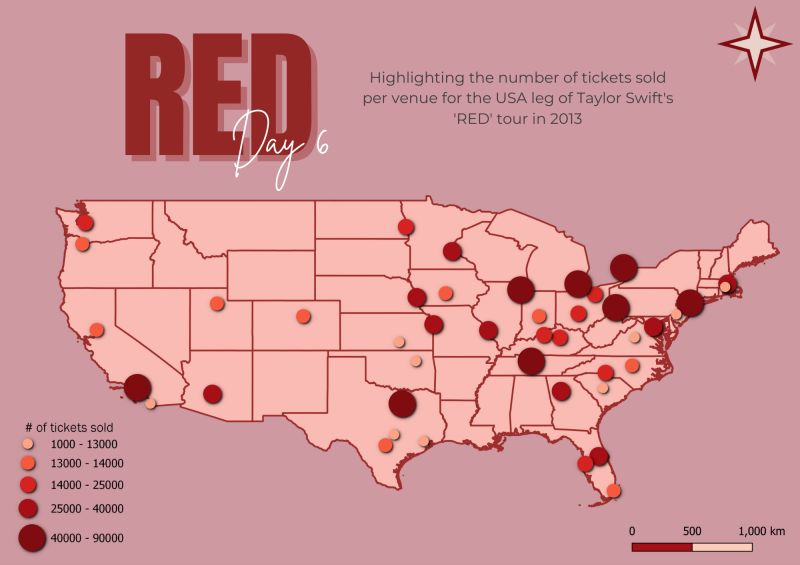

## 30 Day Map Challenge: by Zaana!

This is a quick website for all the maps I've made for 2021's [30 Day Map Challenge](https://github.com/tjukanovt/30DayMapChallenge). This is my first year participating and I've had a blast!

Even though it was not a requirement, I managed to complete a map for each day. My main motivations for this challenge were to revisit old techniques, learn new ones, and try to create whatever I can, even if it were a map done in 5 minutes' time!

This was an amazing opportunity to build my confidence in mapping, as well as network with some amazing people in the field! I am a fan of every single person who made something this month, and I can't wait to see what everyone gets up to in the future.

I also posted my maps daily on both [Twitter](http://twitter.com/zaaaana_) and [LinkedIn](http://linkedin.com/in/zaaaana), so feel free to connect with me on either platform!

Now, let's get into it!

### Day 1: Points
_Created in QGIS. Map of Rapa Nui (Easter Island) highlighting locations of Moai statues_

### Day 2: Lines
_Created in QGIS, with data processed in R. Map highlighting travel flow from the UK to the rest of the world_

### Day 3: Polygons
_Created in QGIS. Simple polygon map showcasing the glacial cover of Jan Mayen, Svalbard_

### Day 4: Hexagons
_Created in QGIS. Hex map of Indian states, highlighting percentage of Hindu population_

Markdown is a lightweight and easy-to-use syntax for styling your writing. It includes conventions for

### Day 5: Challenge 1: OpenStreetMap
_Created in Python using the [prettymaps](https://github.com/marceloprates/prettymaps) package and data from Overpass Turbo_

### Day 6: Red (Taylor's Version)
_Created in QGIS. Quick map of # of ticket sales at each USA venue of Taylor Swift's 2013 RED Tour_

### Day 7: Green
_Created in QGIS. Point map highlighting ASDA locations in the UK_
[!Image](Maps/Day7_green.jpg)

### Day 8: Blue
_Created in QGIS. 2021 Hypoxia data in the Gulf of Mexico, based on max. dissolved oxygen_
[!Image](Maps/Day8_blue.jpg)

### Day 9: Monochrome
_Created in QGIS with data from Overpass Turbo. Map of the road network in Port of Spain, Trinidad_
[!Image](Maps/Day9_mono.jpg)

### Day 10: Raster
_Created in QGIS. Hillshade map of Barbados_
[!Image](Maps/Day10_raster.jpg)

### Day 11: 3D
_Created in R with [Rayshader](https://www.rayshader.com/). Plan view map of Kilauea, Hawaii. Rayshader attempt #1_
[!Image](Maps/Day11_3d.jpg)

### Day 12: Population
_Created in QGIS. Population density changes in Washington_
[!Image](Maps/Day12_pop.jpg)

### Day 13: Challenge 2: Natural Earth
_Created in QGIS. Bathymetry properties of the Caribbean Sea. Symbology styles by [John Nelson](https://www.esri.com/arcgis-blog/products/mapping/mapping/absurd-paper-maps-in-pro/)_
[!Image](Maps/Day13_nat.jpg)

### Day 14: New Tool
_Created in kepler.gl. Population Density of London, following the tutorial by [Alasdair Rae](http://www.statsmapsnpix.com/2018/09/a-kepler-tutorial-plus-data.html)

### Day 15: Map made without a computer
_Created with embroidery floss in macrame style: small globe with pattern via [Braceletbook.com](https://www.braceletbook.com/patterns/alpha/104488/)_
[!Image](Maps/Day15_nocomp.jpg)

### Day 16: Urban / Rural
_Created in QGIS with data processed in R. Urban and Rural areas of 2010 California_
[!Image](Maps/Day16_urbrur.jpg)

### Day 17: Land
_Created in QGIS. Visualising raster data of landuse in India in 1985 vs 2005_
[!Image](Day17_Land.jpg)

### Day 18: Water
_Created in QGIS. Water bodies of Canada >10 ha. in surface area_
[!Image](Day18_water.jpg)

### Day 19: Islands
_Created in QGIS. Quick map of Åland Islands, highlighting main airports and airfields_
[!Image](Day19_Islands.jpg)

### Day 20: Movement
_Created in QGIS, data processed in R. Map showcasing movement of 3 Herons from the [MDIFW tracking project](https://wildlife.org/heron-tracking-project-gps-data-for-all-to-use-and-learn-from/)_
[!Image](Day20_Movement.jpg)

### Day 21: Elevation
_Created in QGIS. Elevation data of Vancouver / Vancouver Island_
[!Image](Day21_Elevations.jpg)

### Day 22: Boundaries
_Created in QGIS. Quick map highlighting the major districts within Trinidad_
[!Image](Day22_Boundaries.jpg)

### Day 23: Challenge 3: GHSL
_Created in QGIS and Aerialod. Map highlighting population density in the UK_
[!Image](Day23_GHSL.jpg)

### Day 24: Historical
_Created in QGIS. Historical map of ~1925 Trinidad highlighting the island's now-defunct railway, with an overlay of the current major road and highway network_
[!Image](Day24_Historical.jpg)

### Day 25: Interactive
_Created with Mapbox and Github. Interactive map highlighting the usage of the Night Tube in London during the first 5 months of service. Check it out [here](https://zaaaana.github.io/CASA0003/)
[!Image](Day25_interactive.gif)

### Day 26: Choropleth
_Created in QGIS. Map highlighting population % of dog owners in the contiguous US states_
[!Image](Day26_Choropleth.jpg)

### Day 27: Heatmap
_Created in QGIS, data processed in R. Heatmap of wildfires in California between 2010 and 2018, per millions of acres affected_
[!Image](Day27_Heatmap.jpg)

### Day 28: The earth is not flat
_Created in R with [Rayshader](http://rayshader.com). 3D Map of Hilo, Hawai'i, following the tutorial by [David Solito](https://www.davidsolito.com/post/a-rayshader-base-tutortial-bonus-hawaii/?_x_tr_sl=auto&_x_tr_tl=en&_x_tr_hl=en-GB&_x_tr_pto=nui). Rayshader attempt #2_
[!Image](Day28_Notflat.jpg)

### Day 29: NULL
_Created in QGIS. Map of Oregon and Boring, OR, highlighting location of Gravity Falls (can you tell I had no clue what to make this day...)_
[!Image](Day29_Null.jpg)

And that's about the size of it! Datasets for each map will be uploaded / linked to my repo soon!
